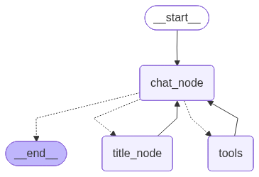

# LangGraph Persistent Chat

A **LangGraph-powered conversational AI** with persistent memory, custom tools, and a clean Streamlit frontend.  
The system is designed with modular backends and frontends, supporting multi-threaded conversations with database persistence.

---

## ✨ Features

- **Persistent Memory**: Conversations are saved and can be retrieved across sessions.
- **Multiple Tools**: Integrated browsing, calculator, and stock price tools.
- **LangGraph Orchestration**: Node- and edge-based workflow with conditional routing.
- **Streaming Responses**: Real-time assistant replies via Streamlit’s streaming API.
- **Thread Management**: Sidebar for switching between different conversation threads.

---

## 🚀 Getting Started

### 1. Clone the Repository
```bash
git clone https://github.com/Ayush-Rawat-1/langgraph-persistent-chat.git
cd langgraph-persistent-chat
```
### 2. Install Dependencies
```bash
pip install -r requirements.txt
```
### 3. Set Environment Variables
Create a .env file in the project root with the following keys:
```env
GROQ_API_KEY=your_groq_api_key
ALPHA_VANTAGE_API_KEY=your_alpha_vantage_key
```
### 4. Run the Application
Launch the frontend (Streamlit app):
```env
streamlit run langgraph_frontend_final.py
```

---

## 🛠 Tools Integrated
- **Browsing Tool** – Search the web using DuckDuckGo.  
- **Calculator Tool** – Safely evaluate math expressions.  
- **Stock Price Tool** – Fetch live stock prices via the Alpha Vantage API.  

---

## Architecture

Below is the flow of the chatbot powered by LangGraph:



---

## 🖥 Backend Explanation

The backend is built using **LangGraph** for conversational state management and persistence.  

### Key Components:
- **LLM Integration**:  
  Uses `ChatGroq` with the `openai/gpt-oss-20b` model for chat responses.  
- **Tools**:  
  - `DuckDuckGoSearchRun`: Web browsing/search tool.  
  - `calculator`: Safe Python expression evaluator.  
  - `get_stock_price`: Fetches real-time stock data using Alpha Vantage API.  
- **State Management**:  
  Defined with a `ChatState` TypedDict containing:  
  - `messages`: Conversation history (system, human, AI).  
  - `metadata`: Stores additional information like generated chat titles.  
- **Graph Design**:  
  - `chat_node`: Handles LLM responses with optional tool calls.  
  - `tools`: Executes requested tools.  
  - `title_node`: Generates a short conversation title (3–6 words) from the first user query.  
  - **Conditional Edges** ensure smooth routing:
    - Tools are invoked only when needed.  
    - Titles are generated only if they don’t exist yet.  
- **Persistence**:  
  - Uses **SQLite** with `SqliteSaver` for checkpointing and restoring conversation state.  
  - Functions provided:
    - `retrieve_all_threads()`: Returns all unique thread IDs.  
    - `retrieve_all_threads_with_titles()`: Returns all threads along with their generated titles for UI display.  

This architecture ensures **persistent multi-threaded conversations** with recoverable context, tool integration, and automatic chat titling.  

---

## 🎨 Frontend Explanation

The frontend is built with **Streamlit** to provide an interactive chat UI.  

### Key Features:
- **Persistent Threads**: Sidebar lists all conversations retrieved from the backend with titles.  
- **Conversation Loading**: Clicking a thread loads its full history.  
- **New Chat**: Start fresh with a new thread ID.  
- **Streaming Responses**: Assistant replies stream in real-time, with live status updates when tools are used.  

This ensures a smooth **multi-threaded chat experience** with persistent memory and tool-assisted responses.  

---

## 📌 Notes
- Built on **LangGraph** for node-based orchestration.  
- Persistent memory using **SQLite3**.
- Modular **backend** and **frontend** design for extensibility.  

---

